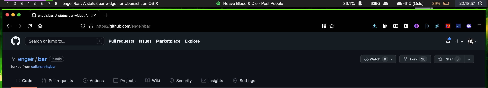

# Bar

Bar is an  [Übersicht](https://github.com/felixhageloh/uebersicht) widget
that places a customizable bar on your desktop.

## Elements

- Workspaces (active and focused space and title of focused window) from [yabai](https://github.com/koekeishiya/yabai)
- Currently playing music from
  - Spotify
- CPU
- Free disk space
- Weather
- Battery
- Date/Time

## Installation

Download (or clone) this repository and place the folder in your Übersicht widgets directory.

## Questions?

If you find a bug or have any questions about Bar, [submit an issue](https://github.com/callahanrts/bar/issues/new).

